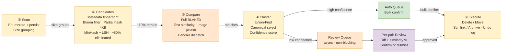
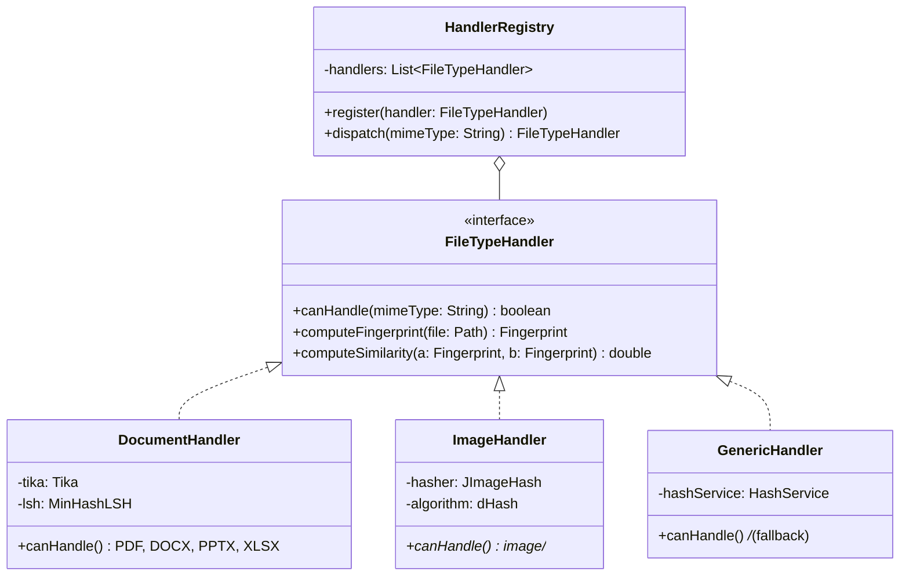
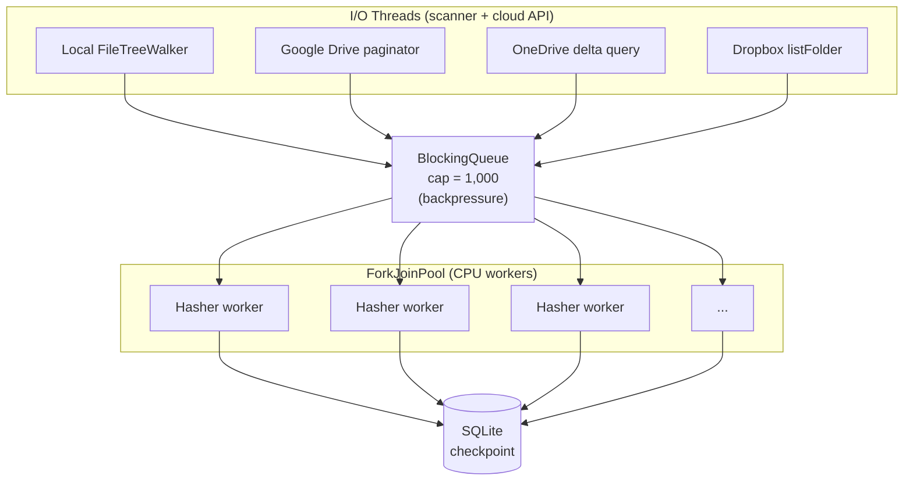
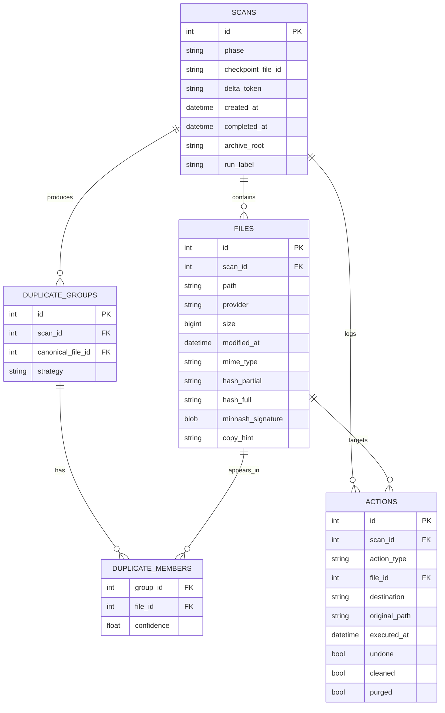
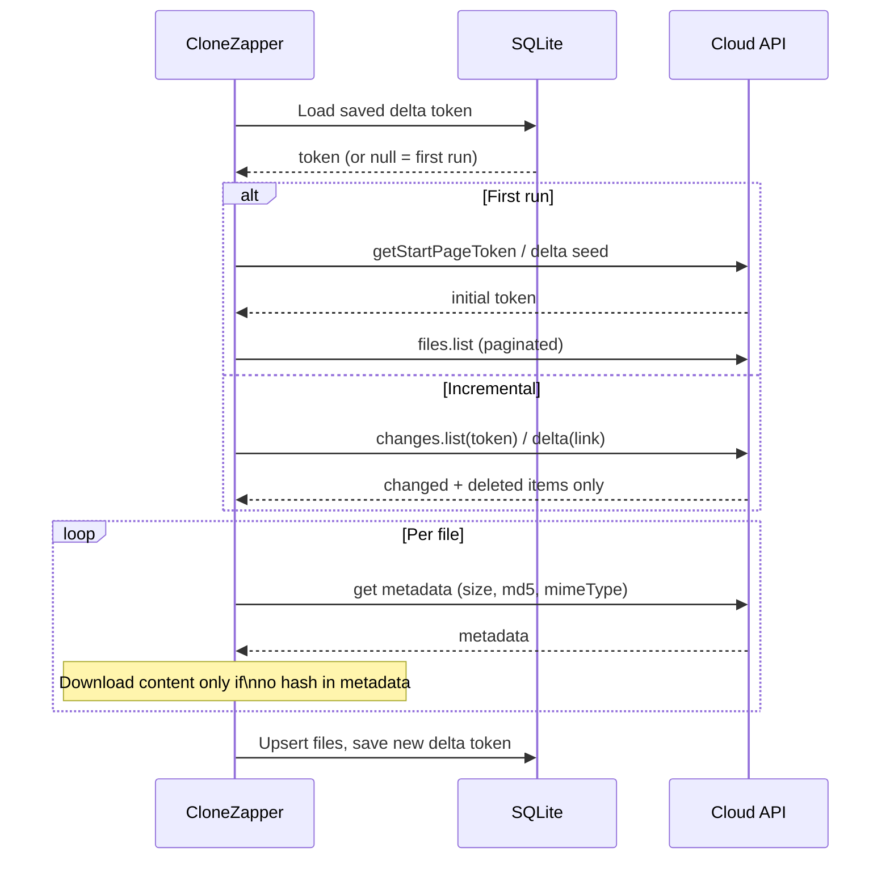

# CloneZapper — Design Document

> See [`architecture.drawio`](architecture.drawio) for the full system architecture diagram (open in [draw.io](https://app.diagrams.net)).

---

## Overview

CloneZapper is a five-stage deduplication pipeline that scans local and cloud storage, progressively filters candidates from millions of files down to confirmed duplicate groups, then presents results for safe human-controlled cleanup.

Three capabilities no competitor offers:
1. **Cross-boundary scanning** — local ↔ cloud without syncing
2. **Content-aware matching** — same document in different formats (PDF vs DOCX vs scan)
3. **Safe-by-design** — never auto-deletes; every action is reviewable and undoable

---

## Pipeline



**Key filtering ratios:**
- Size grouping eliminates ~80% of files immediately
- Partial hash (first 4 KB) eliminates ~90% of size-matched candidates
- Only ~1–5% of files reach expensive full comparison

---

## Metadata Pre-filter

Runs at the start of Stage ② before any hashing. Uses only data already collected during Stage ① (no extra I/O).

| Signal | Interpretation | Action |
|--------|---------------|--------|
| Same `size` + `modified_at` + filename | Almost certainly the same file in two locations | Boost confidence; fast-track to partial hash |
| Filename matches copy-pattern: `(1)`, `Copy of …`, `… - Copy` | Explicit OS-level copy made by user | Tag `copy_hint = explicit_copy`; still verify with partial hash |
| Same `size` + extension, different name | Possible rename | Continue through normal candidate pipeline |
| Same name, different `size` | Different versions — not a duplicate | Deprioritise; skip deeper comparison |

**Caveats baked into the logic:**
- Cloud sync (OneDrive, Dropbox) frequently rewrites `modified_at` — timestamp match alone is never sufficient for deletion routing.
- Same filename in different folders (e.g. `resume.pdf` in `/2023/` and `/2024/`) is weak signal — path context is checked.
- Metadata match boosts confidence and reduces hashing work; it does **not** bypass the partial-hash confirm step.

`copy_hint` is persisted in the `FILES` table so the CLI `results` command can surface explicit copies as a distinct group.

---

## Confidence-Based Action Routing

After Stage ④ Cluster assigns a confidence score, groups are routed to one of two independent queues:

- **Auto Queue** (`confidence ≥ threshold`, default 0.95): presented as a bulk list for one-click confirm. Does not wait for the Review Queue.
- **Review Queue** (`confidence < threshold`): async, non-blocking. User can review per-pair diffs (showing similarity %, side-by-side content) at any time without holding up the Auto Queue.

Both queues feed the same `Execute` stage and write to the same undo log.

---

## Session Report

Printed automatically after `stage` completes, and re-playable any time via `clonezapper report`. All numbers are computed from the `FILES` and `ACTIONS` tables at report time — no separate stats table needed.

```
━━━━━━━━━━━━━━━━━━━━━━━━━━━━━━━━━━━━━━━━━━
  CloneZapper — Session Report
━━━━━━━━━━━━━━━━━━━━━━━━━━━━━━━━━━━━━━━━━━
  Scanned       12,847 files · 3 providers
  Scan time     1m 42s  |  Compare  3m 15s  |  Total  4m 57s

  Duplicate groups          234
    Exact matches           187     1.2 GB
    Near-duplicates          31     340 MB
    Explicit copies          16      89 MB   ← copy_hint tagged

  Actions taken
    Deleted                 142 files   →   1.4 GB freed
    Moved                    38 files   →   /Archive/Duplicates/
    Symlinked                12 files
    Pending review           42 files   →   (open Review Queue)

  Folders affected           67
  Providers touched          Local FS · Google Drive

  Destination folders
    /Archive/Duplicates/Docs/
    /Archive/Duplicates/Images/
━━━━━━━━━━━━━━━━━━━━━━━━━━━━━━━━━━━━━━━━━━
```

**Live folder links** — destination paths are rendered as OSC 8 terminal hyperlinks (`\e]8;;file:///path\e\\`). Clicking opens the folder directly in the OS file manager. Supported by Windows Terminal, iTerm2, Ghostty, and most modern terminals. Raw paths are always printed as fallback for unsupported terminals.

**Breakdown dimensions available:**
- By action type (deleted / moved / symlinked / pending)
- By file type (images / documents / audio / other)
- By provider (Local FS / Google Drive / OneDrive / Dropbox)
- By duplicate strategy (exact hash / near-dup text / image pHash / explicit copy)

---

## File Preservation & Archive Structure

### Two-phase model

```
stage   → moves duplicates to archive (reversible staging — nothing permanently lost)
purge   → deletes the archive for a run (point of no return, explicit confirm required)
cleanup → moves files back from archive to their original locations (full undo of a run)
```

No shortcuts, no `.lnk` files. The archive folder is the safety net.

### What stays where

| Item | What happens after `stage` |
|------|---------------------------|
| Canonical copy | Stays exactly in its original location — path and hierarchy untouched |
| Duplicate file | Moved to `{archive_root}/run_{timestamp}/` with full path mirrored |
| Original duplicate location | Empty — the file is gone until `cleanup` restores it or `purge` confirms deletion |

### Archive folder structure

Each run gets its own timestamped folder under the configured archive root:

```
{archive_root}/
  run_20260329_143022/                ← scan_id + timestamp, one per run
    _clonezapper_report.json          ← machine-readable run report (re-importable)
    _clonezapper_report.html          ← human-readable run report
    C/
      Downloads/
        report.pdf                    ← duplicate moved here, original path mirrored
      Desktop/
        Old/
          report.pdf
    GoogleDrive/
      My Drive/
        Shared/
          report.pdf
  run_20260328_091500/
    _clonezapper_report.json
    ...
```

The `_clonezapper_report.json` is a full export of the ACTIONS and FILES records for that run. On next launch, CloneZapper scans the archive root for these files and re-imports any runs not already in the local DB — giving persistent cross-machine history.

### Canonical selection criteria (priority order, user-configurable)

1. File is in a user-designated trusted folder (e.g. `Documents/`, `My Drive/`)
2. Older `modified_at` — original tends to be older than the copy
3. Richer path — deeper in a meaningful folder vs. `Downloads/` or `Desktop/`
4. Larger file size — for images, prefer higher resolution
5. User override in Review Queue (always available)

---

## Cleanup, Purge & Undo Commands

### `cleanup` — undo a run (fully reversible)
```
clonezapper cleanup <run-id>    # restore all duplicates to original locations for one run
clonezapper cleanup --all       # restore all runs
```
Moves files back from `archive/run_{id}/` to their original paths as recorded in ACTIONS. Removes the archive folder once complete. Marks run as `cleaned` in DB. Safe — original path must be empty (no overwrite without `--force`).

### `purge` — permanent deletion (point of no return)
```
clonezapper purge <run-id>      # permanently delete archive for one run
clonezapper purge --all         # permanently delete all archives
```
Prints a summary of what will be deleted and requires explicit confirmation (`yes/no`). Deletes the archive folder and its contents. Marks run as `purged` in DB. Cannot be undone.

### Relationship
```
stage ──→ [archive staging] ──→ purge   (forward: confirm and delete permanently)
                           ──→ cleanup  (backward: restore everything)
```

---

## Overlapping Runs

Running CloneZapper multiple times on the same source is expected. Three mechanisms prevent bloat and wasted effort:

### 1. Archive auto-exclusion
The configured archive root is always injected into the scan exclude list. The archive is never scanned, regardless of what source paths the user provides.

### 2. Archive auto-exclusion during enumeration
The archive root is never scanned — files inside it are not enumerated as candidates regardless of what source paths the user provides.

### 3. Incremental scan (checkpoint-based)
For each file path already in the DB from a prior scan: if `size` and `modified_at` are unchanged, the existing `hash_partial`, `hash_full`, and `minhash_signature` are reused — no re-hashing. Only new or changed files are processed.

```
On re-scan of a source path:
  file unchanged (size + modified_at match DB) → reuse existing fingerprints
  file changed                                 → reprocess fully
  file not in DB                               → process as new
  file in DB but no longer on disk             → mark as deleted
```

### 4. Overlap warning (new source path overlaps a recent run)
If a newly requested scan path contains files already processed in a run from the last N days, CloneZapper warns:

```
⚠ Source path overlaps with run_20260328_091500 (yesterday).
  347 files already processed and unchanged.
  Options:
    [1] Skip unchanged files (recommended — incremental)
    [2] Re-scan everything
    [3] Cancel
```

---

## User Interfaces

CloneZapper exposes two interfaces over the same backend engine. The engine (UnifiedScanner + pipeline services) is interface-agnostic.

### CLI (`picocli`)
For power users, scripting, and CI/CD. Subcommands:

| Command | Purpose |
|---------|---------|
| `scan [paths]` | Start or resume a scan (incremental by default) |
| `results` | Print duplicate groups to stdout |
| `stage` | Move duplicates to archive staging (reversible) |
| `cleanup [run-id]` | Restore duplicates to original locations, remove archive |
| `purge [run-id]` | Permanently delete archive for a run (confirm required) |
| `report` | Re-print the session report for a run |
| `history` | List all past runs with status and stats |

### Web UI (Mateu)
For non-technical users. Runs on an embedded Spring Boot server (`localhost:8080`); user opens it in any browser. No separate install.

**[Mateu](https://github.com/miguelperezcolom/mateu)** is a Java annotation-driven framework — UI screens are defined as plain Java classes with `@UI` / `@MenuOption` annotations. No HTML, CSS, or JavaScript. Backend developers control the entire UI.

| Screen | What it does |
|--------|-------------|
| Dashboard | Scan status, last report summary, quick-start button |
| Scan | Configure paths + providers, start / pause / resume |
| Results | Browse duplicate groups; filter by type, provider, confidence |
| Auto Queue | Bulk confirm list for high-confidence matches |
| Review Queue | Per-pair diff view — similarity %, side-by-side preview, confirm or dismiss |
| Session Report | Full analytics dashboard with folder links |
| Settings | Confidence threshold, default action, provider credentials |

**Caveats:**
- Mateu is web-only for now (native desktop is on their roadmap). Local browser is sufficient for CloneZapper's single-user use case.
- Smaller community (50 stars as of 2026). If Mateu stalls, **Vaadin** is the drop-in fallback — same annotation-driven paradigm, much larger ecosystem.
- Requires the embedded Spring Boot server to be running while the user interacts with results.

---

## Development Focus

**Text document deduplication is the current priority. All other media types (images, audio, video) are deferred until text handling is mature and complete.**

| Handler | Status | Notes |
|---------|--------|-------|
| `DocumentHandler` | ✅ Active | PDF, DOCX, PPTX, XLSX via Apache Tika + MinHash LSH — primary focus |
| `GenericHandler` | ✅ Active | Fallback exact-hash (BLAKE3) for all file types |
| `ImageHandler` | ⏸ Low priority | dHash/pHash perceptual hashing is implemented but not a current focus — will be revisited once document dedup is fully mature |
| Audio handler | ❌ Not implemented — low priority | Planned but deferred; requires perceptual audio fingerprinting (e.g. Chromaprint) |
| Video handler | ❌ Not implemented — low priority | Planned but deferred; requires frame-level perceptual hashing |

---

## Plugin Architecture

File-type handling is dispatched via a `HandlerRegistry` loaded through Java `ServiceLoader`. Adding a new format requires only a new `FileTypeHandler` implementation — no changes to the pipeline.



---

## Concurrency Model

I/O-bound scanning and CPU-bound hashing run on separate thread pools connected via a bounded queue. Backpressure prevents OOM on large datasets. Each batch is checkpointed so scans are resumable.



---

## Database Schema



---

## Cloud Scan Flow (Incremental)



---

## Key Design Decisions

| Decision | Choice | Reason |
|----------|--------|--------|
| Hash algorithm | BLAKE3 | Best throughput/security tradeoff; xxHash3 excluded (non-cryptographic) |
| Near-dedup | MinHash + LSH → cosine verify | LSH for O(n) candidate generation; cosine for precision |
| Image dedup | dHash primary, pHash verify | dHash handles gradients well; pHash survives DCT compression |
| Persistence | SQLite WAL mode | Single portable file; concurrent reads; FTS5 for text search |
| Plugin dispatch | ServiceLoader + MIME type | Zero coupling; new handlers deployable without recompile |
| Cloud scanning | Delta APIs (changes.list, @odata.deltaLink) | Avoid full re-scan on every run |
| False positive policy | Candidate → precise verify → human confirm | Data loss from false positives is irreversible |
| Metadata pre-filter | Name + size + modified_at + copy-pattern checked before hashing | Eliminates obvious duplicates cheaply; copy-naming patterns (`(1)`, `Copy of`) surfaced as `copy_hint` early |
| Action routing | Confidence threshold splits Auto Queue vs Review Queue | High-confidence pairs process without waiting for human review of ambiguous cases |
| Session report | Computed from ACTIONS + FILES at report time; no separate stats table | Always accurate, even after undo; avoids denormalization |
| Live folder links | OSC 8 terminal hyperlinks for destination paths | One-click navigation to where files were moved; raw path printed as fallback |
| Quarantine model (two-phase) | `stage` moves to archive; `purge` permanently deletes | Familiar trash/staging mental model; nothing irreversible until explicit `purge` |
| Per-run archive folders | `run_{timestamp}/` under archive root | Multiple runs don't overwrite each other; each has its own report file |
| Run report in archive | `_clonezapper_report.json` + `.html` in each run folder | Persistent history; re-importable into DB on any machine |
| Incremental re-scan | Reuse fingerprints for unchanged files (`size` + `modified_at` match) | Re-running on same source does no redundant hashing |
| Overlap warning | Detect source paths covered by recent runs before scanning | Prevents accidental full re-scan; prompts incremental mode |

---

## Next Steps

### Tier 1 — Quick wins (no external dependencies)

| Item | Detail |
|------|--------|
| **`ScanCommand` auto-report** | After scan completes, `scan` prints just "Run ID / Phase" — should automatically print the full session report so CLI users see results immediately without a separate `report` call |
| **Dashboard cleanup/purge actions** | After staging, DashboardView shows the archive path but offers no Cleanup or Purge button — users must drop to the CLI to undo or confirm a stage |
| **`confidence.threshold` in `application.properties`** | `ScanSettings` hardcodes `0.95` at startup; add `clonezapper.confidence.threshold` property so the default is configurable without touching the UI or recompiling |
| **Archive re-import on startup** | On launch, scan the configured archive root for `_clonezapper_report.json` files and re-import any runs not already present in the DB — enables cross-machine history and recovery from DB loss |

### Tier 2 — Moderate complexity

| Item | Detail |
|------|--------|
| **Concurrency model** | Pipeline is currently single-threaded. Switch to the designed BlockingQueue + ForkJoinPool model (I/O walkers feed a bounded queue; CPU hashers drain it) to hit the >500 MB/s target on large directories |
| **Auto Queue / Review Queue split in ResultsView** | ResultsView shows all duplicate groups in one flat list. High-confidence groups (≥ threshold) should have a "Stage all auto-queue" bulk action; low-confidence groups should be clearly separated with a direct link to the Review Queue |

### Tier 3 — Cloud providers (OAuth required)

| Item | Detail |
|------|--------|
| **Google Drive connector** | OAuth 2.0 (`drive:readonly`), paginated `files.list`, incremental `changes.list` delta token — the biggest product differentiator; implement first |
| **OneDrive connector** | MSAL OAuth, `/drives/{id}/root/delta` incremental query, `@odata.deltaLink` persistence |
| **Dropbox connector** | Dropbox SDK OAuth, `files/list_folder` + cursor-based incremental updates |
